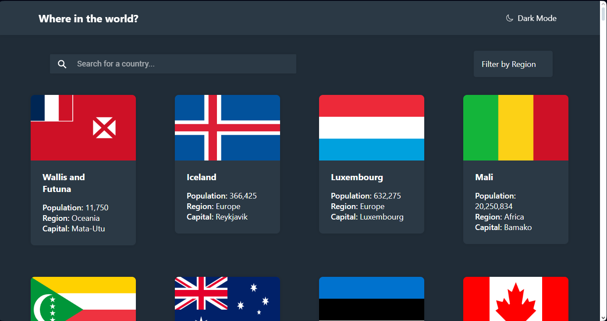
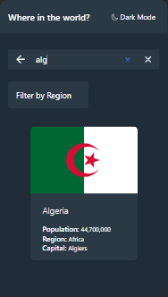

# Frontend Mentor - REST Countries API with color theme switcher solution

This is a solution to the [REST Countries API with color theme switcher challenge on Frontend Mentor](https://www.frontendmentor.io/challenges/rest-countries-api-with-color-theme-switcher-5cacc469fec04111f7b848ca).

## Table of contents

- [The challenge](#the-challenge)
  - [Screenshot](#screenshot)
  - [Built with](#built-with)
  - [Run locally](#run-locally)
  - [Purpose](#Purpose)
- [Author](#author)
- [Acknowledgments](#acknowledgments)

## The challenge

Users should be able to:

- See all countries from the API on the homepage
- Search for a country using an `input` field
- Filter countries by region
- Click on a country to see more detailed information on a separate page
- Click through to the border countries on the detail page
- Toggle the color scheme between light and dark mode _(optional)_

### Screenshot




### Built with

- HTML
- CSS modules
- [React](https://reactjs.org/)
- [React Router](https://reactrouter.com/)
- [Ionic](https://ionicframework.com/)

### Run locally

- Clone the repository
- Run `npm install` to install the dependencies
- Run `npm run dev` to start the development server

### Purpose

The purpose of this project is to practice using React, context api and React Router. I also wanted to practice using the Ionic framework.

## Author

- [Email1](mailto:mouloudj.mohamed.04@gmail.com) or [Email2](mailto:mouloudy656565@gmail.com)
- Frontend Mentor - [@MohamedMouloudj](https://www.frontendmentor.io/profile/MohamedMouloudj)
- Linkedin - [Mohamed Mouloudj](https://www.linkedin.com/in/mohamed-mouloudj-547020247/)

## Acknowledgments

Depend on yourself, add extra work from your own, and don't be lazy or think that you know everything or you are advanced , you still have a lot to learn, good developers are those who know their lack of knowledge and try to fill it.

```

```
